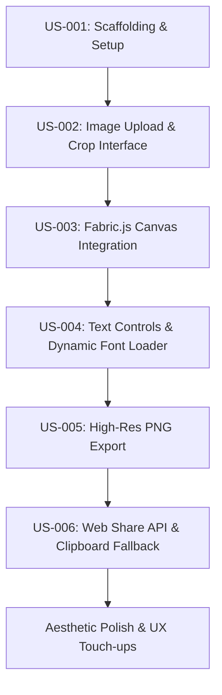

# Design Plan: Greeting Card Creator

This design plan summarizes the architecture, user flow, technical choices, and visual design layout for the **Greeting Card Creator** application, incorporating the dashboard aesthetic from [image.png](file:///Users/gro/dev/greeting-card-creator/docs/image.png) and the requirements in the [PRD](file:///Users/gro/dev/greeting-card-creator/tasks/prd-greeting-card-creator.md).

---

## 🛠️ Architecture & Tech Stack

- **Framework:** React + Vite + TypeScript
- **Styling:** Tailwind CSS + Vanilla CSS (for custom elements and canvas wrappers)
- **Canvas Management:** Fabric.js (v5)
- **Cropping Library:** `react-image-crop` (to handle robust touch, mouse gestures, and zoom)
- **Icons:** `lucide-react`
- **Fonts:** Dynamic Google Fonts loading (10+ fonts like *Montserrat*, *Playfair Display*, *Great Vibes*, *Pacifico*, etc.)

---

## 🎨 Visual Design & UI Layout

We are adopting the modern dashboard aesthetic from the reference image, featuring **soft pastel/neon gradients** in the background, **rounded white card panels** with subtle drop shadows, and a clean, responsive workspace.

### Step 1: Upload & Crop (Mandatory First Step)
- **Interface:** A centered, focused card modal overlaid on a soft gradient background.
- **Features:**
  - Drag-and-drop or click-to-select file upload zone.
  - Interactive cropper using `react-image-crop` with preset aspect ratio buttons (1:1, 4:5, 9:16, 5:7).
  - Zoom slider and pan controls.
  - "Apply Crop & Design" primary button to unlock Step 2.

### Step 2: Design Canvas Workspace
Once the crop is applied, the user is transitioned to the main editor:
- **Background:** Soft gradient (e.g., lavender/rose/blue) to match the reference styling.
- **Left Navigation Sidebar:**
  - Clean icons (similar to the reference dashboard's sidebar) to switch tabs:
    - **Templates:** 4-5 text styling configurations (e.g., "Minimalist Birthday", "Elegant Thank You", "Retro Holiday") to quickly overlay stylish text onto the crop.
    - **Add Text:** Button to add new custom text layers.
    - **Canvas Adjustments:** Adjust background crop scale/offset or aspect ratio.
- **Center Canvas Container:**
  - The Fabric.js canvas is hosted inside a beautiful, rounded white card with a subtle border and shadow.
  - **Sizing:** Fixed internal virtual canvas resolution (e.g., 1200px on the longest side) scaled down visually via CSS to fit the viewport seamlessly on both desktop and mobile.
- **Right Contextual Settings Panel:**
  - Displays controls dynamically when a text layer is selected:
    - Font Family dropdown (10+ Google Fonts).
    - Font size slider, font weight toggles (Regular/Bold), styles (Italic).
    - Color picker palette.
    - Alignment controls.
    - Layer actions (Bring to Front, Send to Back, Delete).
- **Header Action Bar:**
  - Quick action buttons: "Start Over", "Export (PNG)", and "Share Card".

---

## ⚙️ Key Technical Implementations

### 1. Responsive Canvas via Fixed Virtual Resolution
To avoid layout shifts and scaling discrepancies across devices:
- We initialize the Fabric.js canvas size to match the target cropped aspect ratio at a high virtual size (e.g., if 4:5 ratio, canvas is set to $960 \times 1200$ pixels).
- We style the canvas container with CSS to fit the screen viewport responsively. Fabric's visual size scales down, but coordinates and font sizes remain fixed and crisp.

### 2. Dynamic Google Fonts Loader
To prevent loading unnecessary fonts:
- When a user selects a font (e.g., *Great Vibes*), we check if a `<link>` stylesheet exists for it.
- If not, we inject it dynamically: `<link href="https://fonts.googleapis.com/css2?family=Great+Vibes&display=swap" rel="stylesheet">`.
- We use `document.fonts.load("1em Great Vibes")` to await loading.
- Once loaded, we trigger `canvas.requestRenderAll()` so the text updates instantly.

### 3. Crisp Export & Web Share
- **Export:** Render the canvas to a PNG data URL using Fabric's built-in export features at the native 1200px resolution.
- **Share:** 
  - On mobile browsers supporting the Web Share API, we convert the PNG data URL into a `File` object and invoke `navigator.share({ files: [file] })`.
  - On desktop/unsupported browsers, display a modal dialog with:
    - Clipboard Copy button (copies the image directly to the clipboard).
    - WhatsApp Web deep-link button.
    - Instructions with a 1-click PNG download button.

---

## 📅 Implementation Roadmap

### Milestone Steps:
1. **Scaffold React-Vite Project:** Initialize with Tailwind, Lucide React, Fabric.js, and `react-image-crop`.
2. **Build Cropping Component:** Set up file upload, aspect ratio presets, zoom, and crop output.
3. **Set Up Canvas Engine:** Connect Fabric.js and render the cropped image background at a fixed virtual size.
4. **Implement Text Layers & Settings Panel:** Add text, drag/scale controls, style controls, and the dynamic font injector.
5. **Implement Templates tab:** Create predefined font/style overlays.
6. **Implement Exporting and Sharing flows:** Write logic for Web Share API and desktop clipboard copy fallback.
7. **Refine UI/UX:** Apply soft gradients, glassmorphism, transitions, and polish typography.
